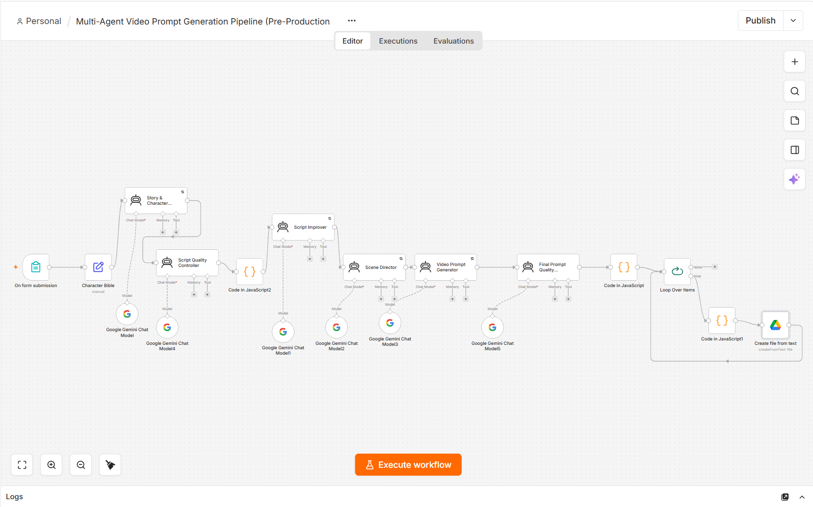
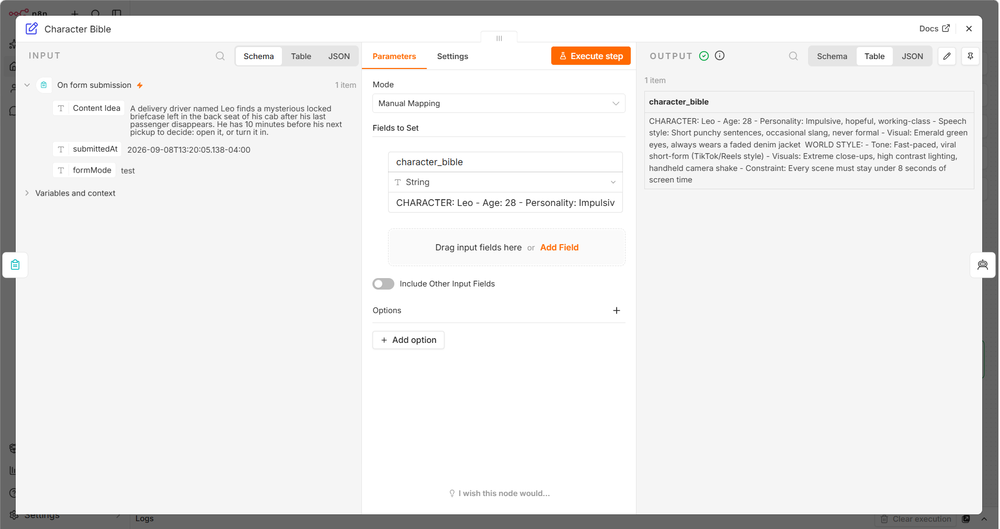
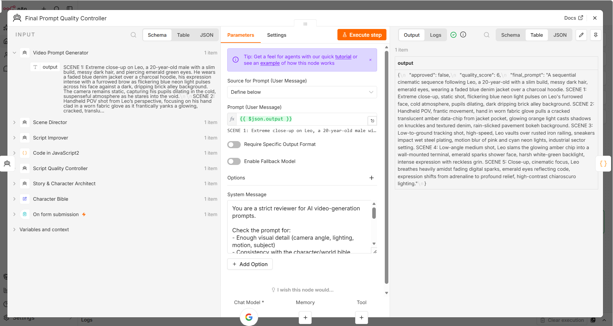
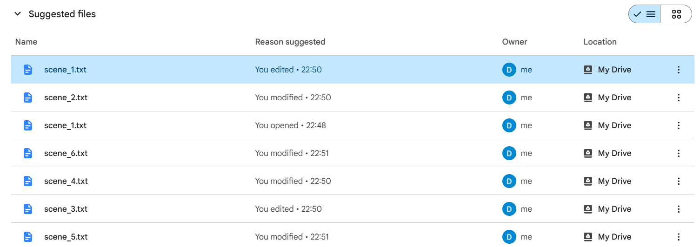

# 🎬 AI Short-Form Video Automation — Multi-Agent Prompt Generation Pipeline

An **n8n-powered multi-agent system** that turns a single story idea into a complete set of **production-ready AI video generation prompts** — fully automated, from concept to Google Drive.

> Input: one story idea → Output: 5–6 scene-by-scene AI video prompts, ready to feed into any AI video generator (Runway, Sora, Kling, etc.)

---
## 🧠 Architecture
On Form Submission (story idea)
│
▼
🧬 Story & Character Agent → generates the story and locks character identity/consistency
│
▼
🔧 Code in JavaScript2 → formats data between stages
│
▼
✅ Script Quality Controller → reviews the generated script for quality and coherence
│
▼
✍️ Script Improver → refines and rewrites the script based on quality feedback
│
▼
🎭 Scene Director → breaks the improved script into individual scenes
│
▼
🎥 Video Prompt Generator → converts each scene into a detailed video-generation prompt
│
▼
✅ Final Prompt Quality Checker → validates final prompts for consistency & clarity
│
▼
🔧 Code in JavaScript → formats output into a list
│
▼
🔁 Loop Over Items → iterates over each scene prompt (6 items)
│
▼
🔧 Code in JavaScript1 → prepares each item for file creation
│
▼
📁 Create File From Text → saves each scene prompt to Google Drive

## 🤖 The 6 AI Agents

| # | Agent | Role |
|---|---|---|
| 1 | **Story & Character Agent** | Generates the core story and establishes/locks character identity, appearance, and traits so every scene stays consistent |
| 2 | **Script Quality Controller** | Reviews the generated script for coherence, pacing, and quality |
| 3 | **Script Improver** | Refines and rewrites the script based on the quality controller's feedback |
| 4 | **Scene Director** | Breaks the improved script into individual, well-structured scenes |
| 5 | **Video Prompt Generator** | Converts each scene into a final, detailed AI-video-generation prompt |
| 6 | **Final Prompt Quality Checker** | Validates all final prompts for consistency and clarity before saving |

## 🔄 Workflow

1. User submits a story idea via a form trigger
2. Story & Character Agent generates the story and a locked character profile
3. Script Quality Controller reviews the script
4. Script Improver refines the script based on that feedback
5. Scene Director splits the improved script into 5–6 scenes
6. Video Prompt Generator writes a video-gen prompt for each scene
7. Final Prompt Quality Checker validates all generated prompts
8. Output is formatted and looped over (6 items)
9. Each finished prompt is saved as an individual file to **Google Drive**
10. User feeds each prompt into an AI video generator and stitches the clips into one final video

## ⚙️ Setup

1. Install [n8n](https://n8n.io/) (self-hosted or cloud)
2. Import `workflow/n8n-workflow.json` into your n8n instance
3. Connect your **Gemini API** credentials to each AI Agent node
4. Connect your **Google Drive** credentials to the output node
5. Activate the workflow and open the form trigger URL to submit a story idea

## 🎬 Example

**Full Pipeline Overview**

**Character Bible (Locked Character Consistency)**

**Script Quality Check**

**Scene Breakdown**

**Final Prompt Quality Check**

**Output Saved to Google Drive**

**Demo Video**
[Watch the full workflow in action](https://youtu.be/7bWJiQLOG7g)

## 🔐 Security

- No API keys or credentials are stored in this repository
- All credentials (Gemini, Google Drive) are managed via n8n's built-in credential manager

## 📂 Repo Structure
  ├── workflow/
│ └── n8n-workflow.json
├── screenshots/
│ └── (pipeline screenshots)
└── README.md
