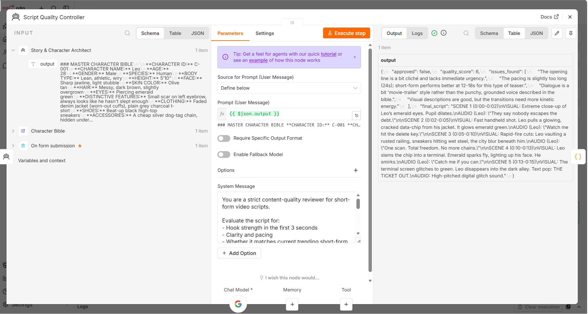
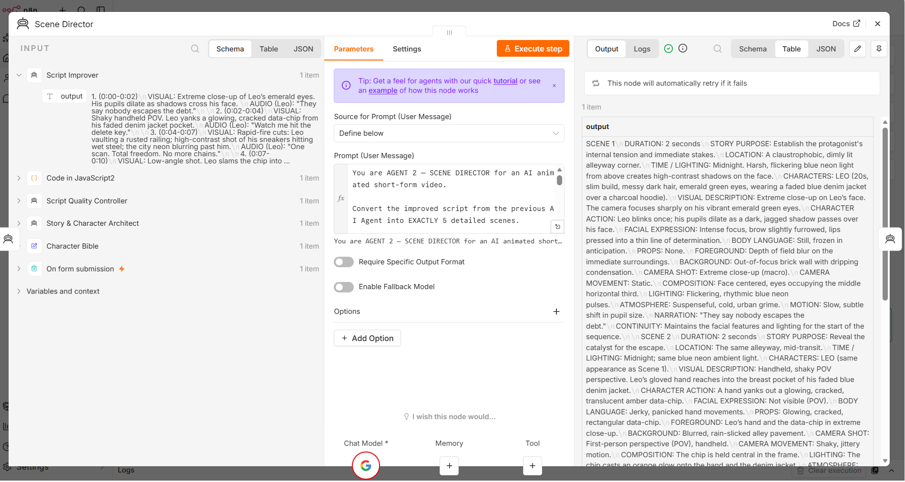

# Multi-Agent-Video-Prompt-Generation-Pipeline-Pre-Production
Multi-agent n8n automation pipeline for transforming story ideas into production-ready AI video prompts.
## Screenshots

**Full Pipeline Overview**

**Character Bible (Locked Character Consistency)**

**Script Quality Check**

**Scene Breakdown**

**Final Prompt Quality Check**

**Output Saved to Google Drive**

   ## Demo Video
   [Watch the full workflow in action](https://youtu.be/7bWJiQLOG7g)
